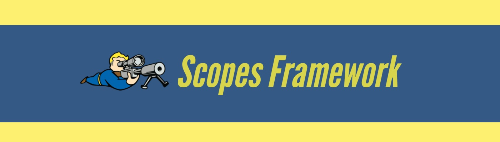

# Fallout 4 Scopes Framework
A Fallout 4 framework for loading custom scopes and optics.
Check out the [video playlist](https://www.youtube.com/playlist?list=PLdEgiq4kaju3CYBlhULuza2JnbikUS18Q) for work in progress footage.

#### Features
* Framework allows all new scope and optic crosshairs for weapons. 
* Easily create custom content. No data plugins, no scripts!
* Optional advanced API for overlays to interact with Papyrus scripting.
* "it just works" 😉

#### Requirements
* Requires a computer, PC only.
* Requires the latest version of F4SE.

#### Installation
* Install with your preferred mod manager, or copy the files into your Fallout 4 data directory.
* Activate `Scopes.esm` anywhere within your load order.

### Mods
* [Wattz Laser Gun](https://www.nexusmods.com/fallout4/mods/26386)
* [LAER (Laser Assisted Electrical Rifle)](https://www.nexusmods.com/fallout4/mods/30868)
* [XM2010 Enhanced Sniper Rifle](https://www.nexusmods.com/fallout4/mods/36750)

#### Acknowledgements
Thanks to the F4SE team for their continued efforts to make mods like this possible.

# Custom Content
This section is for modders who would like to create a custom scope overlay.

The process is simple.
Create a vector based image such as `.svg` or `.ai` for your scope overlay.
Then import your vector image into new flash file (`.fla`), publish the `.swf` to a directory that matches a valid weapon scope object modification. Thats it!

## Notes
With this system a single physical (`.nif`) representation of a scope is paired with a single visual (`.swf`) representation of a scope. A unquie resource identifier for the `.swf` file path is derived from the omod's world model path.
Your scope omod must also add the `HasScope` keyword to a weapon via its property modifiers.
If your scope omod model is `Meshes\Weapons\44\44Scope.nif` then your scope overlay will be autoloaded from `Interface\Weapons\44\44Scope.swf`. 

* Adobe Illustrator
* * Illustrator requires RGB color mode.
* Adobe Flash (Adobe Animate)
* * Document dimensions must be `1280x720` in size.
* * Overlay must be centered on the stage.
